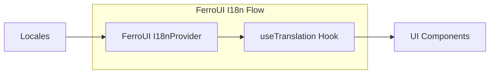

# @ferroui/i18n

Locale resolution, RTL mirroring, and translation provider.

- **Source:** [`packages/i18n`](https://github.com/jxoesneon/FerroUI/tree/main/packages/i18n)
- **package.json:** [view on GitHub](https://github.com/jxoesneon/FerroUI/blob/main/packages/i18n/package.json)

## Generated API

<<<<<<< HEAD
## Generated API

**@ferroui/i18n**

***
=======
**@ferroui/i18n**

---
>>>>>>> 35868da (chore: final cleanup and enterprise alignment)

# @ferroui/i18n

Internationalization and localization utilities for FerroUI.



## Installation

```bash
pnpm add @ferroui/i18n
```

## Usage

### Provider Setup

```tsx
<<<<<<< HEAD
import { I18nProvider } from '@ferroui/i18n';

const locales = {
  'en-US': { common: { welcome: 'Welcome to FerroUI' } },
  'es-ES': { common: { welcome: 'Bienvenido a FerroUI' } }
=======
import { I18nProvider } from "@ferroui/i18n";

const locales = {
  "en-US": { common: { welcome: "Welcome to FerroUI" } },
  "es-ES": { common: { welcome: "Bienvenido a FerroUI" } },
>>>>>>> 35868da (chore: final cleanup and enterprise alignment)
};

export function App() {
  return (
    <I18nProvider locale="en-US" locales={locales}>
      <Welcome />
    </I18nProvider>
  );
}
```

### Hook Usage

```tsx
<<<<<<< HEAD
import { useTranslation } from '@ferroui/i18n';

export function Welcome() {
  const { t } = useTranslation('common');
  return <h1>{t('welcome')}</h1>;
=======
import { useTranslation } from "@ferroui/i18n";

export function Welcome() {
  const { t } = useTranslation("common");
  return <h1>{t("welcome")}</h1>;
>>>>>>> 35868da (chore: final cleanup and enterprise alignment)
}
```

## API Reference

- `useTranslation`: Hook for component translation.
- `I18nProvider`: Context provider for i18n state.
- `formatDate`, `formatNumber`: Intl-based formatting helpers.

## Configuration

Managed via `I18nProvider` props.

## Examples

```tsx
<<<<<<< HEAD
const { t } = useTranslation('common');
return <span>{t('welcome')}</span>;
```

=======
const { t } = useTranslation("common");
return <span>{t("welcome")}</span>;
```
>>>>>>> 35868da (chore: final cleanup and enterprise alignment)
