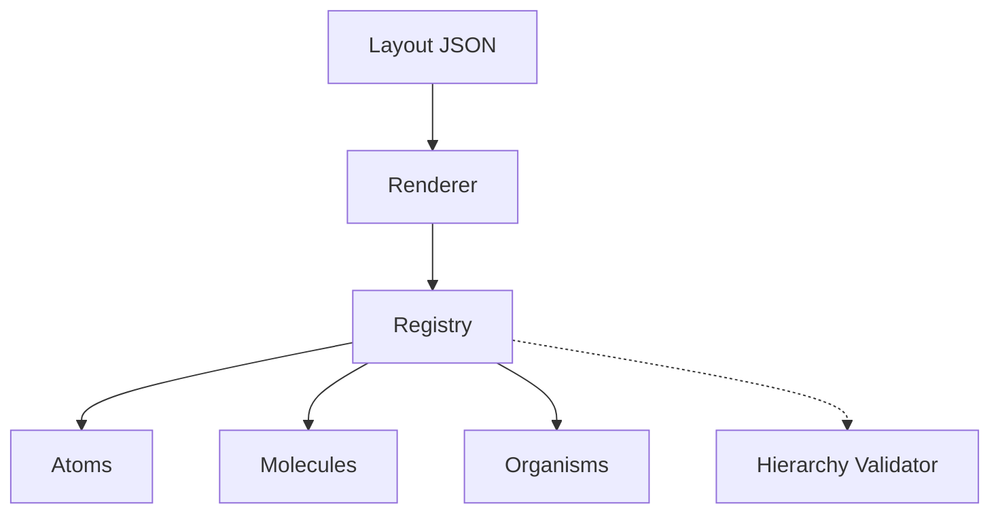

# @ferroui/registry

Atom / Molecule / Organism component registry with Zod schemas.

- **Source:** [`packages/registry`](https://github.com/jxoesneon/FerroUI/tree/main/packages/registry)
- **package.json:** [view on GitHub](https://github.com/jxoesneon/FerroUI/blob/main/packages/registry/package.json)

## Generated API

<<<<<<< HEAD
## Generated API

**@ferroui/registry**

***
=======
**@ferroui/registry**

---
>>>>>>> 35868da (chore: final cleanup and enterprise alignment)

# @ferroui/registry

The Component Registry is the central authority for all FerroUI components. It manages registration, versioning, and hierarchy validation based on Atomic Design principles.

## Architecture



## Features

- **Versioned Registration**: Supports multiple versions of the same component.
- **Atomic Design Enforcement**: Validates that Atoms don't have children and Molecules don't contain Organisms.
- **Inspector Support**: Provides metadata for the Registry Inspector UI.

## Installation

```bash
pnpm add @ferroui/registry
```

## Usage

### Registering a Component

```typescript
<<<<<<< HEAD
import { registerComponent } from '@ferroui/registry';
import { ComponentTier } from '@ferroui/schema';
import { z } from 'zod';

const MyButtonSchema = z.object({
  label: z.string(),
  variant: z.enum(['primary', 'secondary']).default('primary')
});

registerComponent({
  name: 'MyButton',
  version: 1,
  tier: ComponentTier.ATOM,
  component: MyButton,
  schema: MyButtonSchema
=======
import { registerComponent } from "@ferroui/registry";
import { ComponentTier } from "@ferroui/schema";
import { z } from "zod";

const MyButtonSchema = z.object({
  label: z.string(),
  variant: z.enum(["primary", "secondary"]).default("primary"),
});

registerComponent({
  name: "MyButton",
  version: 1,
  tier: ComponentTier.ATOM,
  component: MyButton,
  schema: MyButtonSchema,
>>>>>>> 35868da (chore: final cleanup and enterprise alignment)
});
```

### Retrieving a Component

```typescript
<<<<<<< HEAD
import { registry } from '@ferroui/registry';

const entry = registry.getComponentEntry('MyButton@1');
// or get latest
const latest = registry.getComponentEntry('MyButton');
=======
import { registry } from "@ferroui/registry";

const entry = registry.getComponentEntry("MyButton@1");
// or get latest
const latest = registry.getComponentEntry("MyButton");
>>>>>>> 35868da (chore: final cleanup and enterprise alignment)
```

## API Reference

- `ComponentRegistry`: Core singleton class.
- `registerComponent(options)`: Registers a new component.
- `getComponentEntry(identifier)`: Retrieves a component entry.
- `validateHierarchy(layout)`: Checks if a layout follows atomic rules.
<<<<<<< HEAD

=======
>>>>>>> 35868da (chore: final cleanup and enterprise alignment)
