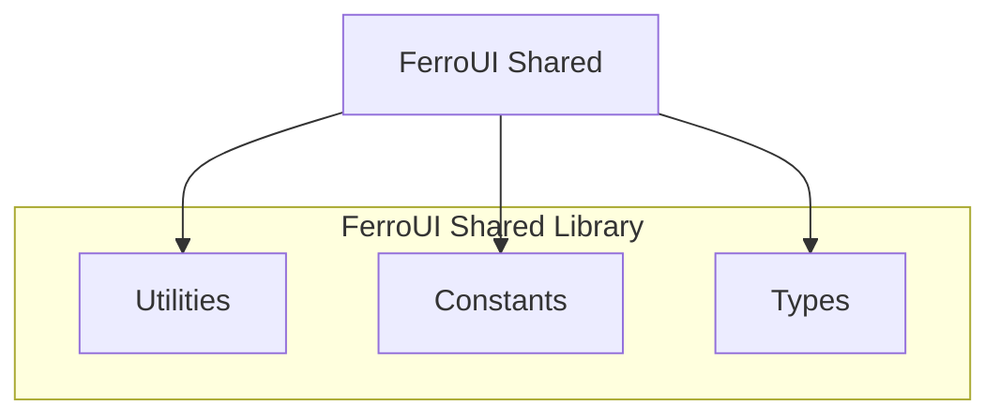

# @ferroui/shared

Internal utilities shared across FerroUI packages.

- **Source:** [`packages/shared`](https://github.com/jxoesneon/FerroUI/tree/main/packages/shared)
- **package.json:** [view on GitHub](https://github.com/jxoesneon/FerroUI/blob/main/packages/shared/package.json)

## Generated API

<<<<<<< HEAD
## Generated API

**@ferroui/shared**

***
=======
**@ferroui/shared**

---
>>>>>>> 35868da (chore: final cleanup and enterprise alignment)

# @ferroui/shared

Shared utilities, types, and constants for FerroUI.



## Installation

```bash
pnpm add @ferroui/shared
```

## Usage

```typescript
<<<<<<< HEAD
import { deepMerge, type AnyMap } from '@ferroui/shared';
=======
import { deepMerge, type AnyMap } from "@ferroui/shared";
>>>>>>> 35868da (chore: final cleanup and enterprise alignment)

const base = { a: 1, b: { c: 2 } };
const override = { b: { d: 3 } };

const merged = deepMerge(base, override);
// { a: 1, b: { c: 2, d: 3 } }
```

## API Reference

Varies by module.

## Configuration

N/A

## Examples

```typescript
<<<<<<< HEAD
import { deepMerge } from '@ferroui/shared';
```

=======
import { deepMerge } from "@ferroui/shared";
```
>>>>>>> 35868da (chore: final cleanup and enterprise alignment)
