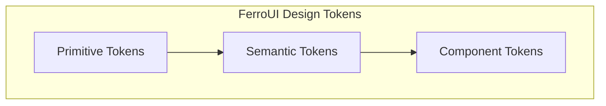

# @ferroui/tokens

Design token pipeline with Style Dictionary outputs.

- **Source:** [`packages/tokens`](https://github.com/jxoesneon/FerroUI/tree/main/packages/tokens)
- **package.json:** [view on GitHub](https://github.com/jxoesneon/FerroUI/blob/main/packages/tokens/package.json)

## Generated API

<<<<<<< HEAD
## Generated API

**@ferroui/tokens**

***
=======
**@ferroui/tokens**

---
>>>>>>> 35868da (chore: final cleanup and enterprise alignment)

# @ferroui/tokens

Design tokens for the FerroUI system.



## Installation

```bash
pnpm add @ferroui/tokens
```

## Usage

Import tokens for use in CSS or JS.

### CSS

```css
@import "@ferroui/tokens/dist/variables.css";

.my-component {
  background-color: var(--fui-semantic-bg-primary);
  padding: var(--fui-primitive-spacing-4);
}
```

### JavaScript/TypeScript

```typescript
<<<<<<< HEAD
import { tokens } from '@ferroui/tokens';
=======
import { tokens } from "@ferroui/tokens";
>>>>>>> 35868da (chore: final cleanup and enterprise alignment)

const style = {
  backgroundColor: tokens.semantic.bg.primary,
  padding: tokens.primitive.spacing[4],
};
```

## API Reference

- `primitive`: Core color and spacing definitions.
- `semantic`: Role-based tokens (e.g., `primary-bg`).
- `component`: Component-specific tokens.

## Configuration

N/A

## Examples

```css
@import "@ferroui/tokens/dist/variables.css";
```
<<<<<<< HEAD

=======
>>>>>>> 35868da (chore: final cleanup and enterprise alignment)
